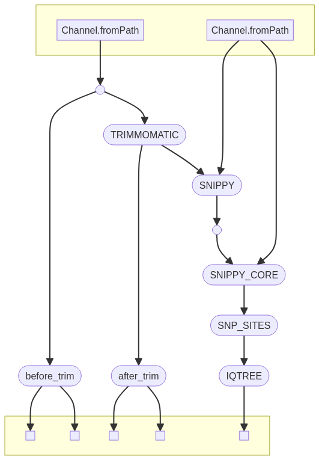

# Cholera-training-KEMRI
A repository for developing workflows to work with bacteria samples. the focus is phylogenetic analysis. the end result of the pipeline is a *newick* formatted tree

the script processes are viewed in the following dag



# requirements
the repository uses git-lfs to download test data in the fastq format. before you clone the repo, makesure you have this setup in your system with git

## cloning the repo
to clone the repo, make sure you have [git](https://git-scm.com/) and [git-lfs](https://git-lfs.com/) set up in your system

```
git clone git@github.com:4youalways/Cholera-training-KEMRI.git

```

## install nextflow

install nextflow in your system. below is an example of installing and using nextflow using the [conda](https://conda.io/projects/conda/en/latest/user-guide/getting-started.html) package manager
```
# create a conda environment
conda create -n nextflow

# activate the environment
conda activate nextflow

# install nextflow in the environment
conda install -c conda-forge -c bioconda nextflow

```

the pipleline works well with nextflow version above 22.10.4

## user input
the pipeline takes 2 inputs from the user
- a sample sheet with the format *XXX*
- a reference genome in fasta or genbank format

## running the pipeline
to run the pipeline run the following in the cloned git repository
```
nextflow run <nextflow optional arguments> src/pipeline.nf --sample_sheet <path_to_user_sample_sheet> --ref <path_to_reference_genome>
```

the pipeline comes with optional test data
```
# to test pipeline functionality
nextflow run src/pipeline.nf
```

## pipeline output
the current version will save all the process output to the output folder. future versions will aim to inly save qc and the newick format tree files
```
# the pipeline will create the following folders
results
    after_trime
    before_trim
    consesus
    phylo
    tree
    trimmomatic
    variants

```